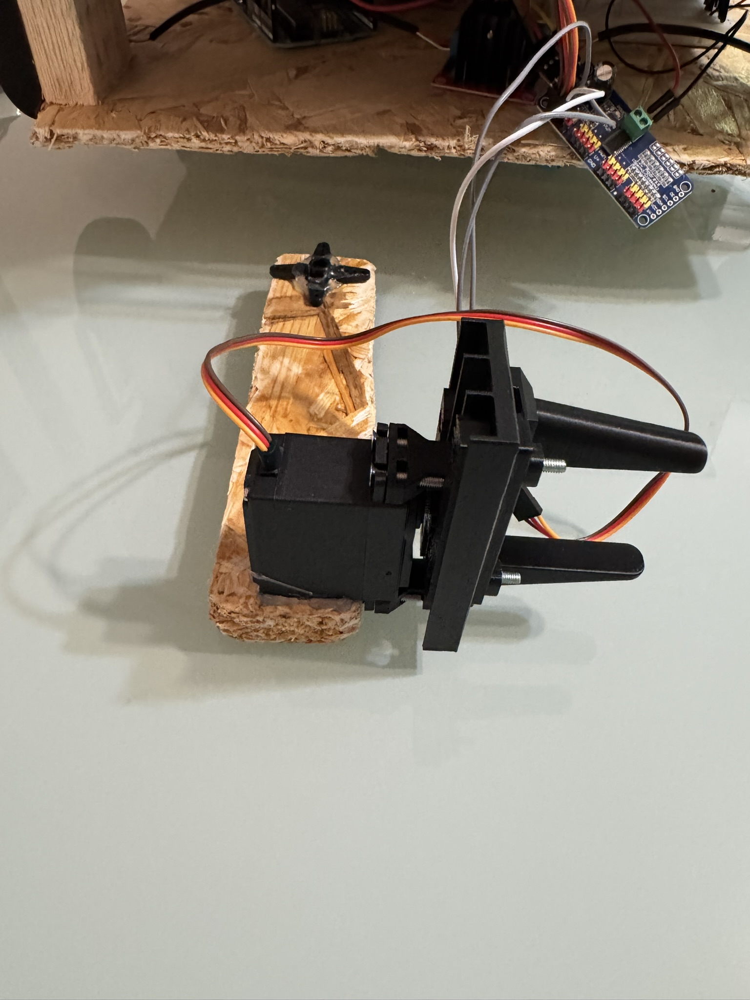
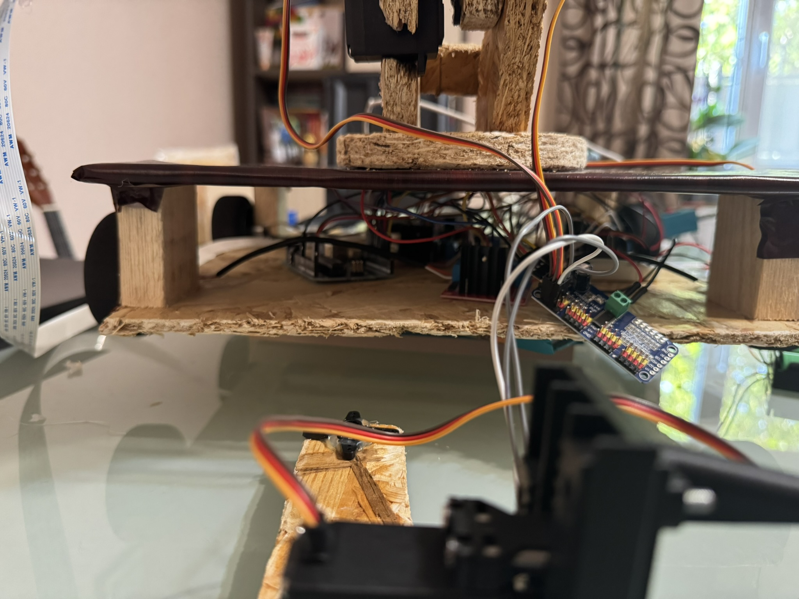

# PET Grabber

## Robot telecomandat pentru gestionarea acumulărilor de deșeuri

**PET Grabber** este un robot conceput pentru soluționarea problemei gunoaielor. Acesta este manevrat de pe site-ul [pet-grabber.web.app](https://pet-grabber.web.app), cu ajutorul unei interfețe intuitive, proiectate pentru toate platformele. Proiectul are mai multe elemente:

* Site-ul **PET Grabber** este făcut în HTML, CSS și Vanilla JS, este găzduit pe [Firebase](https://firebase.google.com/), o suită de unelte pentru dezvoltarea aplicațiilor web, iar autentificarea și stocarea datelor se fac prin același serviciu (Firebase Authentication și Firebase Realtime Database).

* Odată autentificat, utilizatorul are acces la live stream-ul de la Pi Camera, realizat printr-un server Flask pe `localhost:5000` ([`stream.py`](/robot/stream.py)). Acest server este expus în siguranță pe Internet prin intermediul unui [Cloudflare Tunnel](https://developers.cloudflare.com/cloudflare-one/connections/connect-networks/), o conexiune similară unui VPN, care nu necesită porturi în rețea. Astfel, se obține un URL cu stream-ul, care este deschis pe site.

* De pe site, utilizatorul trimite comenzi, care sunt stocate în timp real în baza de date Firebase. [Codul de pe Raspberry Pi](/robot/cod_raspberry.py) monitorează schimbările din baza de date și trimite controalele introduse de utilizator la un Arduino UNO printr-o conexiune serial.
* Robotul este construit din plăci [OSB](https://ro.wikipedia.org/wiki/OSB) tăiate manual, pe care sunt plasate componentele. Placa de dezvoltare [Arduino UNO](https://docs.arduino.cc/hardware/uno-rev3/) controlează atât motoarele de la roți, cât și servomotoarele de la brațul robotic și cleștele. 

* Cele [patru roți cu spumă](https://sigmanortec.ro/set-4-roti-din-spuma-rc-67x26-et3) sunt acționate de [4 motoare DC N20](https://www.bitmi.ro/electronica/micromotor-cu-reductie-n20-dc-3-6v-120rpm-10689.html), care sunt controlate de două drivere de motoare [L298N](https://www.emag.ro/modul-driver-motoare-l298n-compatibil-arduino-tri434/pd/DXK3ZQBBM/), care primesc comenzi de la Arduino.

* Cele trei servomotoare [MG996R](https://sigmanortec.ro/servomotor-mg996r-180-13kg) sunt conectate la un modul [PCA9685](https://www.emag.ro/placa-dezvoltare-general-pca9685-16-canale-pwm-12-biti-interfata-iic-alimentare-dc5-10v-gd-0015/pd/DDPYV8YBM/), care primește comenzi de la Arduino prin [interfața I2C](https://en.wikipedia.org/wiki/I%C2%B2C).

* Modulul PCA9865 și cele două drivere de motoare L298N sunt alimentate de 3 baterii [18650](https://www.emag.ro/acumulator-samsung-18650-li-ion-3-7v-25r-curent-maxim-de-descarcare-20a-pentru-dispozitive-electronice-boxe-portabile-tigari-electronice-si-alte-dispozitive-r031100mahbp2/pd/D1WR13BBM/) (cu o tensiune nominală de 3,7V, o capacitate de 2500 mAh și un curent maxim de descărcare continuă de 20A), montate într-un suport, a căror tensiune este redusă la 6V cu ajutorului unui [XL4016](https://www.emag.ro/convertor-descendente-xl4016-1-25-36v-8a-dc-dc-cu-voltmetru-multicolor-step-down-xl4016-disp/pd/DQW798MBM/), filtrat suplimentar cu ajutorul a două condensatoare: [unul electrolitic de 1000 μF/10V](https://www.emag.ro/condensator-electrolitic-1000uf-10v-dc-105-c-elite-pf1a102mnn1016-t128660/pd/D40717MBM/) pentru amortizarea vârfurilor de curent și [unul ceramic de 0.1 μF/50V](https://www.emag.ro/condensator-ceramic-0-1uf-50v-x7r-vishay-k104k10x7rf5uh5-t275622/pd/DY9D7KYBM/) pentru reducerea zgomotului de înaltă frecvență.
* În cazul driverelor de motoare, tensiunea este stabilizată cu încă un modul XL4016.
* Cleștele este un [model 3D de pe thingiverse](https://www.thingiverse.com/thing:2661755) printat din [ABS](https://en.wikipedia.org/wiki/Acrylonitrile_butadiene_styrene).

### Găsiți detalii și în [prezentarea](./Prezentare.pdf) proiectului!

## Lista componentelor

### Materiale

* OSB pentru bază și braț; baza este parțial învelită în folie autocolantă de culoare maro
* ABS pentru cleștele robotului

### Electronică

- Raspberry Pi 4, 4GB
- Arduino UNO
- 2 drivere de motoare L298N (care controlează motoarele DC)
- 1 modul PCA9685 (care controlează servomotoarele)
- 3 baterii 18650
- 2 module XL4016
- 2 condensatoare:
  - 1 condensator electrolitic 1000 μF/10V
  - 1 condensator ceramic 0.1 μF/50V

### Mecanică

- 4 roți cu spumă
- 4 motoare DC N20
- 3 servomotoare MG996R

## Perspective de viitor

### Dezvoltarea unui braț mai avansat

Brațul robotic (care are acum 2 grade de librtate) poate fi modificat pentru a i se adăuga mai multe grade de libertate, atât la baza cilindrică de OSB, care s-ar putea roti (1 grad de libertate), cât și în zona cleștelui, care s-ar putea roti pe toate cele trei axe (X, Y, Z) (3 grade de libertate), pentru un total de **6 grade de libertate**.

### Introducerea AI

O evoluție extrem de importantă o poate constitui introducerea unui model de recunoaștere a obiectelor, precum [YOLOv5](https://github.com/ultralytics/yolov5) sau o versiune mai nouă, antrenat special pe detectarea gunoaielor. Acest model ar putea fi rulat pe Raspberry Pi alături de un model de detectare a distanței față de obiecte, precum [ml-depth-pro](https://github.com/apple/ml-depth-pro), dezvoltat de Apple.

În funcție de aceste informații și folosindu-ne de [inverse kinematics](https://en.wikipedia.org/wiki/Inverse_kinematics) pentru a determina poziția fiecărei componente a brațului robotic, putem transforma PET Grabber dintr-un robot telecomandat într-unul autonom, programându-l să se deplaseze singur la gunoaie, să le ridice și să le depoziteze în coșul de gunoi.

### Materiale

De asemenea, robotul va putea fi confecționat din alte materiale, mai potrivite, poate chiar modelat în CAD și printat 3D, iar cleștele ar putea fi confecționat din PLA, care este biodegradabil, în loc de ABS, cum este acum.

### Roți mai mari

Roțile ar putea fi și ele mai mari, fiind mai potrivite pentru mărimea robotului.

## Imagini și videoclipuri

## Tutoriale
- [No Bullsh*t Guide to Making Modern Websites](https://www.youtube.com/watch?v=WAV66F-Zbio)
- [Arduino IDE: Install Arduino IDE on Linux](https://www.youtube.com/watch?v=eelTpgfa4Y8)
- [Camera Module with Raspberry Pi4](https://www.youtube.com/watch?v=0hrF8Wq8SS)
- [How to Create Github Organization (Full 2025 Guide)](https://www.youtube.com/watch?v=6Byb4wWpPSQ)
- [How to invite members into GitHub organization](https://www.youtube.com/watch?v=2taOQx3u-eM)
- [Arduino to Raspberry Pi Serial Communication](https://www.youtube.com/watch?v=k6t9hNteEX0)
- [Raspberry Pi to Arduino Serial USB Communication](https://www.youtube.com/watch?v=xc9rUI0F6Iw)
- [Arduino - Bidirectional Serial Communication with Raspberry Pi](https://www.youtube.com/watch?v=OJtpA_qTNL0)
- [Arduino - Send Serial Commands from Raspbery Pi](https://www.youtube.com/watch?v=CSUFpPlSbbY)
- [16 channel servo controller with Arduino | PCA9685 16 channel PWM servo motor driver tutorial](https://www.youtube.com/watch?v=vvqUnWweFDs)
- [Getting started with Firebase for the web](https://www.youtube.com/watch?v=rQvOAnNvcNQ)
- [Getting started with Firebase Hosting (and GitHub Actions!)](https://www.youtube.com/watch?v=P0x0LmiknJc)
- [Firebase in 100 Seconds](https://www.youtube.com/watch?v=vAoB4VbhRzM)
- [Introducing Firebase Authentication](https://www.youtube.com/watch?v=8sGY55yxicA)
- [Getting started with Firebase Authentication on the web](https://www.youtube.com/watch?v=rbuSx1yEgV8)
- [Creating Multiple Bundles for Multiple Pages with Webpack - Ep. 7](https://www.youtube.com/watch?v=PcPzKMZzyqc)
- [Beginner Tutorial: How to Stream Video from Raspberry Pi Camera to Local Computer (P3 - piCamera2)](https://www.youtube.com/watch?v=NOAY1aaVPAw)
- [E.P:-22 | How to get data from firebase using raspberry pi | Raspberry pi Series | TechForFun](https://www.youtube.com/watch?v=WcXcKzkM2J0)
- [Setting up a Cloudflare Tunnel on the Raspberry Pi](https://www.youtube.com/watch?v=fZTSW2r97C0)
- [DIY Arduino Robot Arm with Smartphone Control](https://www.youtube.com/watch?v=_B3gWd3A_SI)
- [Git and GitHub Tutorial for Beginners](https://www.youtube.com/watch?v=tRZGeaHPoaw)
- [How to Power an Arduino Project (Lesson #19)](https://www.youtube.com/watch?v=I7MrL5Q7zvY)
- [Power For Your Electronics Projects - Voltage Regulators and Converters](https://www.youtube.com/watch?v=IT19dg73nKU)
- [LM2596 DC-DC Buck Converter Explained | DC-DC Step Down Converter Module | LM2596 Voltage Regulator](https://www.youtube.com/watch?v=DXM_xiR0o1c)
- [How does Buck Converter work? | DC-DC Converter - 1](https://www.youtube.com/watch?v=W6NOV6b8kxs)
